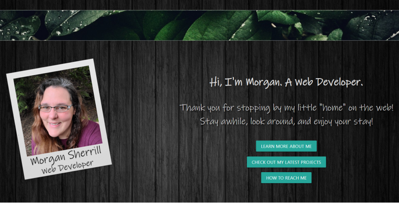
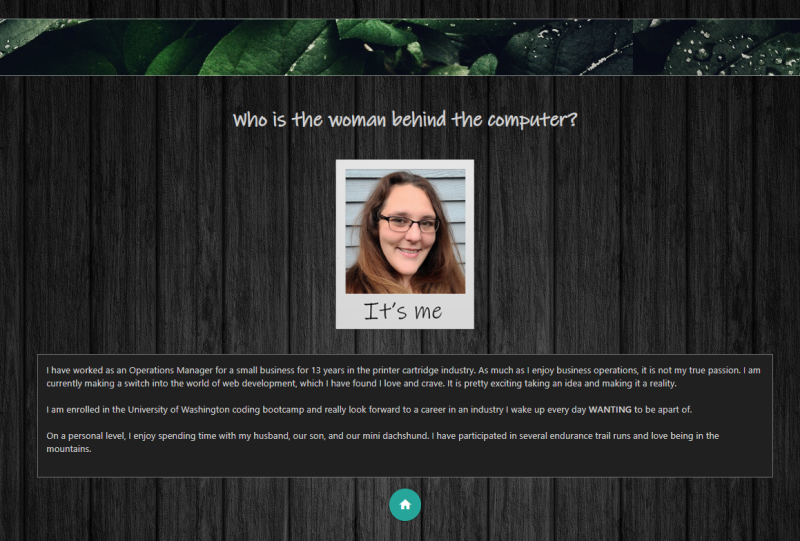
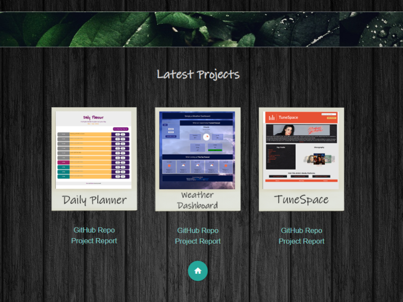

# Portfolio Update

Week 8 Homework

## Description

An updated version of my portfolio. My portfolio should include information about me, examples of some of my work, and a contact section. In addition this week, I did some updating to my GitHub and LinkedIn accounts. As well as, included a resume on my portfolio, which I did not have before. 

## Languages
- HTML
- CSS
- JS

#### With Help From
- Jquery
- Materialize

## Link to GitHub main project page

[Project Page on GitHub](https://github.com/m-sherrill/portfolio)

## Link to Deployed Application

[Live Deployed Link](https://m-sherrill.github.io/portfolio/)

## Screenshots of Finished Product

Landing Page:

About Me Section:

My projects section:

## Contact Information

Github: [@m-sherrill](https://github.com/m-sherrill)

Email: mo.sherrill@outlook.com

